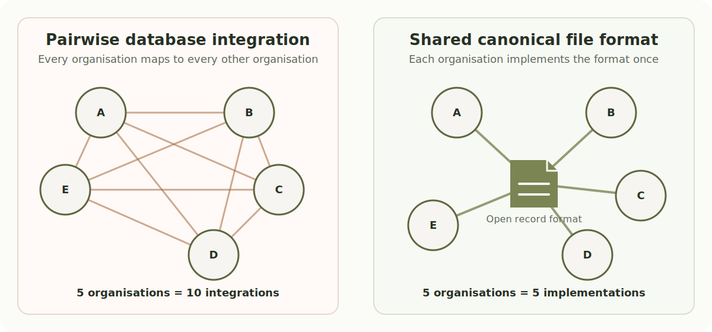
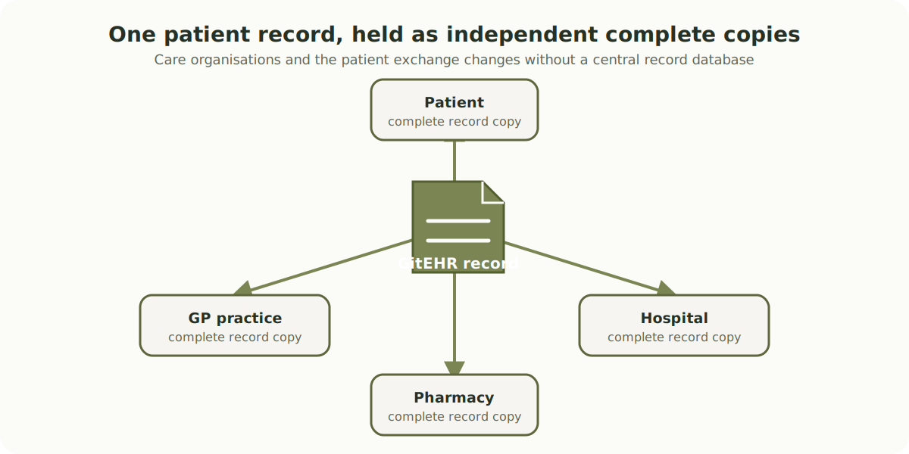
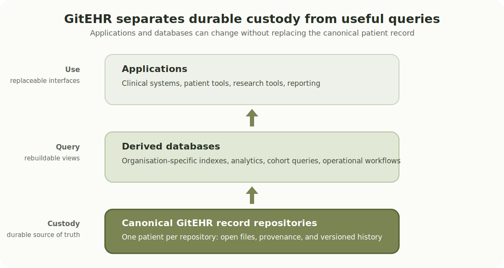

<!-- SPDX-License-Identifier: CC-BY-SA-4.0 -->

# Files, not databases

A patient's record in GitEHR is a folder of plain-text files. Every organisation caring for the patient holds a clone of that folder. Changes sync between organisations the way Git repositories sync between developers.

That is the whole idea. Everything else - the cryptographic integrity, the offline operation, the freedom from vendor lock-in, the patient-centric ownership, the resilience to organisational failure - falls out of that single design choice.

!!! quote "File over app"
    *"File over app is a philosophy: if you want to create digital artifacts that last, they must be files you can control, in formats that are easy to retrieve and read."* - Steph Ango, Obsidian CEO, 2023

## Why this is not a radical idea

Outside healthcare, the rest of software has been steadily abandoning databases as the substrate for portable, long-lived data:

- **Source code.** Git replaced centralised version control systems (CVS, SVN, Perforce) by treating code as content-addressed files distributed across every developer's machine. Every major tech company now runs on this model. The debate is over.
- **Analytics.** The lakehouse architecture ([Apache Iceberg](https://iceberg.apache.org/), Delta Lake, Apache Hudi over Parquet files on object storage) has become the default for modern data platforms. Snowflake, Databricks, DuckDB, Trino and Spark all read the same files because the files, not any single database, are the source of truth.
- **Knowledge work.** Obsidian, Logseq, and the wider "file over app" movement store notes as plain markdown files on disk, on the explicit principle that apps are ephemeral and files outlast them.
- **Imaging.** [DICOM](https://en.wikipedia.org/wiki/DICOM), the one truly successful interoperability standard in healthcare, is fundamentally a file format. Hospitals still mail DICOM CDs between sites when networks fail, and it works.
- **Email.** SMTP and IMAP federate across every provider on earth because the unit of exchange is a self-describing [RFC 5322](https://datatracker.ietf.org/doc/html/rfc5322) file, not a database row. Maildir stores one message per file.
- **Archival.** SQLite, despite the name, is marketed by its creator as ["a better-than-fopen() file format"](https://www.sqlite.org/affcase1.html), and is one of the Library of Congress's [recommended formats for long-term archival storage](https://www.loc.gov/preservation/resources/rfs/data.html).

Healthcare is the holdout, not the pioneer. GitEHR applies the lesson that the rest of software has already learned.

## Healthcare records are an archival problem

Personal medical and hospital records must often survive for a patient's lifetime, and sometimes longer for family and population health research. The [Digital Preservation Coalition's Bit List entry for Electronic Hospital and Medical Records](https://www.dpconline.org/index.php?option=com_content&view=article&id=4519:bitlist-electronic-hospital-medical-records&catid=127:bitlist-endangered&Itemid=989) identifies them as endangered material requiring immediate action. It warns that loss is made more likely by lost context and integrity, poor migration planning, weak records management, and an over-reliance on unsuitable paper-era processes for digital records.

The DPC also observes that there is little evidence of the medical profession participating in the digital-preservation community. That is a serious gap: healthcare has unusually long retention obligations and high consequences of loss, yet its records remain bound to short-lived software products and opaque databases.

GitEHR provides a file-based, archival-grade record format. Its clinical narrative is human-readable text; structured data, documents, images, provenance, and change history are self-contained files in a standard directory layout. A future reader does not need the original supplier's database schema or application simply to inspect the record. The format does not remove the need for preservation governance - managed copies, storage, access control, retention, migration, and disposal still matter - but it gives those processes a durable, inspectable record to preserve. See [Common objections](common-objections.md#does-a-file-format-solve-digital-preservation) and [Longevity](longevity.md) for the limits and rationale.

## Why database-to-database interoperability does not work

The conventional approach to health interoperability is to translate data from one organisation's database into another organisation's database. This produces an N-squared problem.

| Organisations | Pairwise database integrations |
|---|---|
| 5 | 10 |
| 50 | 1,225 |
| 500 | 124,750 |

Every pair of organisations needs a bespoke integration. Every schema change breaks every downstream consumer. The cost scales worse than the value.

Agreeing on a shared file format instead produces N implementations and zero pairwise integrations.

The gap grows rapidly: five organisations require ten custom integrations, fifty require 1,225, and five hundred require 124,750. A shared format does not remove local implementation work, but it makes that work linear rather than combinatorial and lets every participant exchange the same durable record.

### Where DB-to-DB interop appears to work, it is files underneath

Where database-to-database interoperability appears to work at scale in other industries, almost every example reduces, on inspection, to file-based exchange at the wire level:

- **DNS.** The "great distributed database". The interchange format is a [zone file](https://en.wikipedia.org/wiki/Zone_file). The protocol ships zone files in a serialised form. One very narrow schema (name to record).
- **LDAP.** Same pattern. Interchange format is [LDIF](https://en.wikipedia.org/wiki/LDAP_Data_Interchange_Format), which is a file. Narrow schema.
- **SMTP, IMAP, email.** Looks like a federated database. Is actually message-passing of [RFC 5322](https://datatracker.ietf.org/doc/html/rfc5322) documents, which are files.
- **SWIFT, ACH, SEPA, ISO 20022.** Banks have wildly different internal databases. Inter-organisation interop is entirely message-based, on a standardised file schema.
- **DICOM.** Famously good cross-vendor interop in medical imaging, because DICOM is a file format with a wire protocol on top, not the other way around.
- **Salesforce, HubSpot, Workday, ServiceNow.** The canonical enterprise "DB-to-DB" interop story is in fact an entire industry of 1:1 connectors (Mulesoft, Boomi, Workato, Fivetran, Zapier). When it really has to work, the fallback is always CSV export.
- **Database replication.** Within-vendor or near-vendor only. None of it crosses to a different database engine without ETL.
- **Federated query (Trino, Presto, Postgres FDW).** Solves "query data where it lives", but requires per-source connectors. Federation of access, not interop of data.

The deep reason: databases encode local assumptions that do not compose. Type systems, transaction semantics, identity and authentication, query plans, schema evolution policies, null semantics, collation rules, timezone handling. Two files just have to agree on a byte-level format. Two databases have to agree on a worldview.

### The health interop history fits this pattern exactly

The healthcare interoperability projects of the last thirty years - HL7v2, HL7v3, CDA, FHIR, IHE profiles - have been attempts to make databases agree on a worldview. The actual things that move clinical information between UK organisations in 2026 are PDFs in MESH messages, DICOM CDs in the post, and discharge summaries copy-pasted into the receiving system.

The file always wins.

## The lakehouse is the industry quietly conceding the argument

A [lakehouse](https://en.wikipedia.org/wiki/Data_lakehouse) keeps your data in cheap object storage as files (the "lake" part) and adds a metadata layer on top that gives database-like semantics: ACID transactions, schema enforcement, time travel, SQL queries (the "warehouse" part). The term was coined by Databricks around 2020.

Mechanically:

- Actual data is Parquet files on S3, GCS, Azure Blob, MinIO, or any other object store.
- A metadata layer, also stored as files, tracks which Parquet files belong to which table at which point in time, what the schema is, what the partitioning is, and the full transaction log.
- Any compute engine that understands the table format can read and write it. Spark, Trino, DuckDB, ClickHouse, Snowflake, Databricks, Athena, Flink all support Apache Iceberg now.
- You get ACID transactions, schema evolution, and partition evolution, all from the metadata layer.

Apache Iceberg, Delta Lake and Apache Hudi are the dominant table formats. Snowflake adopting Iceberg as a first-class citizen and Databricks acquiring Tabular (the Iceberg company founded by its original creators) are the big moves of the last 18 months.

This matters for GitEHR's argument because the lakehouse is the industry quietly admitting that when you actually need data to be portable across engines, vendors, and time, you put it in files with a well-designed open format and a metadata layer, not in a database. The whole modern AI data stack is built on that admission.

GitEHR is the same shape applied to health records: canonical patient data lives in plain files in a Git repository; organisation-level derived databases sit on top for population queries and operational workflows; applications sit on top of those.

## What about cross-patient queries?

This is the first and best objection. A folder-per-patient model looks like it would make population health, research cohorts, and operational dashboards harder.

It does not, because that workload was never the patient record's job in the first place. In the lakehouse pattern, the canonical files are the source of truth; the database is a derived view built on top for fast queries. GitEHR works the same way:

- The canonical clinical record is a per-patient Git repository.
- An organisation that needs to answer cross-patient queries (a hospital, a research network, a regulator) builds a derived database from its own clone of the patients it cares for.
- The derived database can be rebuilt at any time from the canonical files, on a different schema, in a different engine, by a different vendor.
- If the derived database is lost, the clinical record is not lost.

The current paradigm collapses these two roles into one system, which is why losing the database means losing the record. Separating them is the point.

For the other hard questions about concurrent edits, ACID guarantees, and the right to erasure, see [Common objections](common-objections.md).

## Files make records agent-readable

Files give people and software agents the same durable working surface: directory listings, `grep`, `diff`, and `git log`. An agent can inspect the record and its history directly rather than first translating a question into a database-specific schema, query language, or API.

For a per-patient question such as "what changed in this patient's medication list last month?", an agent can read the relevant state file, inspect the journal, and compare the exact historical versions in context. The evidence remains visible to the person reviewing the answer.

This does not replace the derived databases needed for population-scale research, reporting, or operational queries. It makes the canonical record more legible to the tools that increasingly help patients and clinicians work with it, without adding another proprietary interpretation layer between the record and its reader.

## But the relational model always wins in the end

The most serious version of the objection comes from database research itself. In [*What Goes Around Comes Around... And Around...*](https://db.cs.cmu.edu/papers/2024/whatgoesaround-sigmodrec2024.pdf) (2024), Michael Stonebraker and Andrew Pavlo survey sixty years of data models and conclude that the relational model and SQL keep winning: hierarchical, network, object, XML, document and graph stores all came around, faded, and had their good ideas absorbed into SQL. By that logic, "store the record as files" is just the next doomed alternative.

They are right - about the layer they are describing. That paper is about the **query and active-data-management layer**: the engine you reach for to run ad-hoc queries over large, mutable, multi-tenant datasets. GitEHR makes no claim there. Its claim is about a different layer: the **custody layer**, the durable, portable, patient-owned source of truth.

GitEHR concedes the query layer to exactly the technology Stonebraker champions. When you need to query across patients, you build a derived database - very possibly relational - on top of the canonical files, and rebuild it whenever you like. That is the lakehouse pattern again: files at the bottom, a relational engine on top. "The relational model keeps winning" can be entirely true at the query layer while saying nothing about how the record itself should be kept.

And the two layers have different jobs. The custody layer's unit is one patient's record - megabytes, mostly read, append-only - not a billion-row analytical table, so the "a DBMS wins at scale" arguments simply do not apply to it. What it must optimise for is fifty-year readability, cryptographic tamper-evidence, offline portability, and patient ownership: properties a relational database does not primarily target, and that a folder of signed, content-addressed files provides directly.

There is a sting in the tail of Stonebraker's own argument. His through-line is that SQL endures by *absorbing* good ideas. The one good idea mainstream databases have not absorbed is distributed, content-addressed, immutable version control - Git and Merkle DAGs - which is exactly what GitEHR brings to the custody layer. By the paper's own logic, a good idea does not lose; it gets absorbed. We would call that a win.

## Further reading

- [Local-first software](https://www.inkandswitch.com/local-first/) - Ink and Switch (Kleppmann, Wiggins, van Hardenberg, McGranaghan), 2019. The closest thing to a manifesto for this whole movement.
- [File over app](https://stephango.com/file-over-app) - Steph Ango (Obsidian CEO), 2023.
- [Immutability Changes Everything](https://queue.acm.org/detail.cfm?id=2884038) - Pat Helland, 2015. Make the case from inside the database world.
- [What Goes Around Comes Around... And Around...](https://db.cs.cmu.edu/papers/2024/whatgoesaround-sigmodrec2024.pdf) - Stonebraker and Pavlo, SIGMOD Record 2024. The serious counter-argument that the relational model endures; addressed above.
- [SQLite as an Application File Format](https://www.sqlite.org/affcase1.html) - Richard Hipp.
- [What is a Lakehouse?](https://www.databricks.com/glossary/data-lakehouse) - the original framing from Databricks.
- [Apache Iceberg](https://iceberg.apache.org/) - an open table format for the lakehouse pattern described above.
- [Electronic Hospital and Medical Records](https://www.dpconline.org/index.php?option=com_content&view=article&id=4519:bitlist-electronic-hospital-medical-records&catid=127:bitlist-endangered&Itemid=989) - Digital Preservation Coalition Bit List entry on the preservation risk facing medical records.
